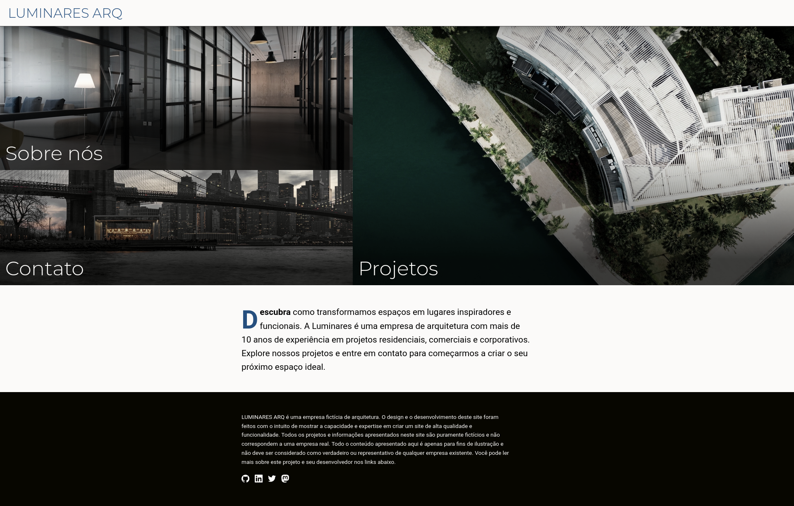

# Luminares Arq

This project is an exercise in designing and developing a website for a fictitious architecture company. It was built using Nuxt, VueJS, Typescript, HTML5, and SASS. The site is hosted on Netlify.

